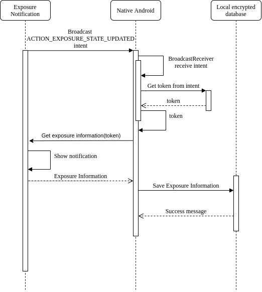

# Receiving Exposures Documentation

When Exposure Notification Framework finishes comparing diagnosis keys with keys stored on the device, it informs about the end of analysis only if there is at least one match by broadcasting **ACTION_EXPOSURE_STATE_UPDATED** intent.

Steps:

- Register a receiver to receive broadcasts of the ACTION_EXPOSURE_STATE_UPDATED intent. 
- Get exposure information from Exposure Notification Framework by passing a token from received intent. Google Play services displays a notification to the user each time this method is invoked.
- Exposure Notification Framework for an exposure key provides a list of **ExposureInformation** objects 
- The app saves exposure information to database with the following data: 
  - Day level resolution that the exposure occurred. 
  - Length of exposure in 5 minute increments, with a 30 minute maximum. 
  - The total risk calculated for the exposure. 

 
