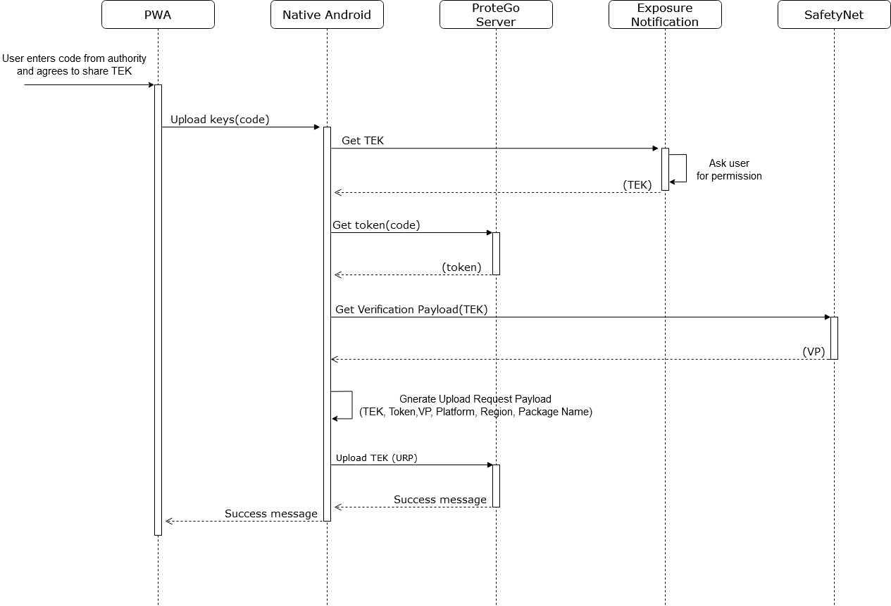

# Temporary Exposure Keys Upload

Once the user is diagnosed with Covid-19 they can share their Temporary Exposure Keys(**TEK**) to inform others, with whom they had contact with, about potential exposition to virus.

Steps:

- User diagnosed with Covid-19 is given a unique 6-character code from the authority employee.
- User enters the code and agrees for TEK upload
- Exposure Notification Framework asks the user for a permission to share TEK with ProteGo Safe App
- The app checks if 6-character code is valid by requesting ProteGo Safe server for a token
- The app generates Verification Payload(**VP**) from TEK using SafetyNet Attestation API. It helps to determine whether the server is interacting with a genuine app.
- The app generates Upload Request Payload(**URP**) with the following data:
  - Temporary Exposure Keys
  - Token
  - Verification Payload
  - Platform name("Android")
  - Region("PL")
  - App package name("pl.gov.mc.protegosafe")
- The app uploads URP to ProteGo Safe server

